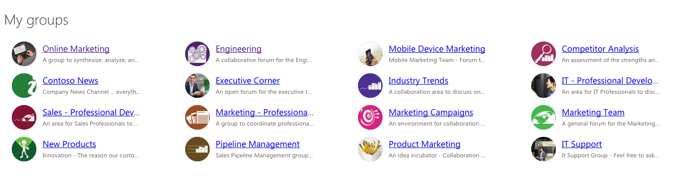

# My Office 365 Groups

This application shows the list of your Office 365 Groups retrieved using the Microsoft Graph.



This web application has been built using [React](https://facebook.github.io/react/) and shows how you can leverage [ADAL JS](https://github.com/AzureAD/azure-activedirectory-library-for-js) to connect to the Microsoft Graph. UX is implemented using [Office UI Fabric](http://dev.office.com/fabric).

## Prerequisites

In order to use this application you need the following prerequisites:
- Office 365 tenant
- admin access to the Azure Active Directory connected to the Office 365 tenant

## Configuration

Following are the steps that you need to complete in order to see this application working:
- in the old Azure Management Portal (https://manage.windowsazure.com/?WT.mc_id=m365-0000-wmastyka):
  - go to Azure Active Directory (AAD)
  - create a new AAD web application
  - set the return URL to `https://localhost:8443`
  - copy the web application's **Client Id**
  - grant the application the following permissions:
    - Windows Azure Active Directory
      - Sign in and read user profile
    - Microsoft Graph
      - Access directory as the signed in user
      - Read all groups
  - in application's manifest enable OAuth implicit flow
- clone this repo
- in the **app/adal/adal-config.js** file in the **clientId** property paste the Client Id of the newly created AAD application
- in the command line:
```
$ npm start
```
- in your web browser navigate to https://localhost:8443
- when prompted, login with your organizational account